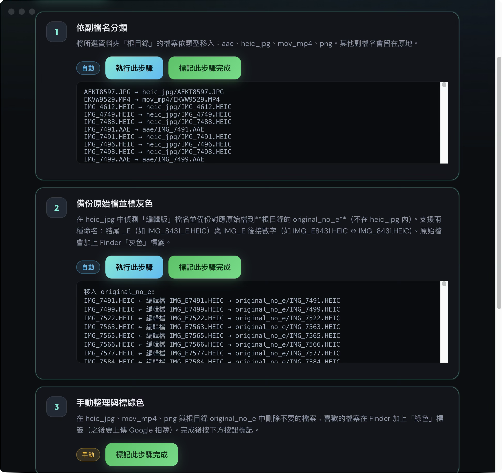
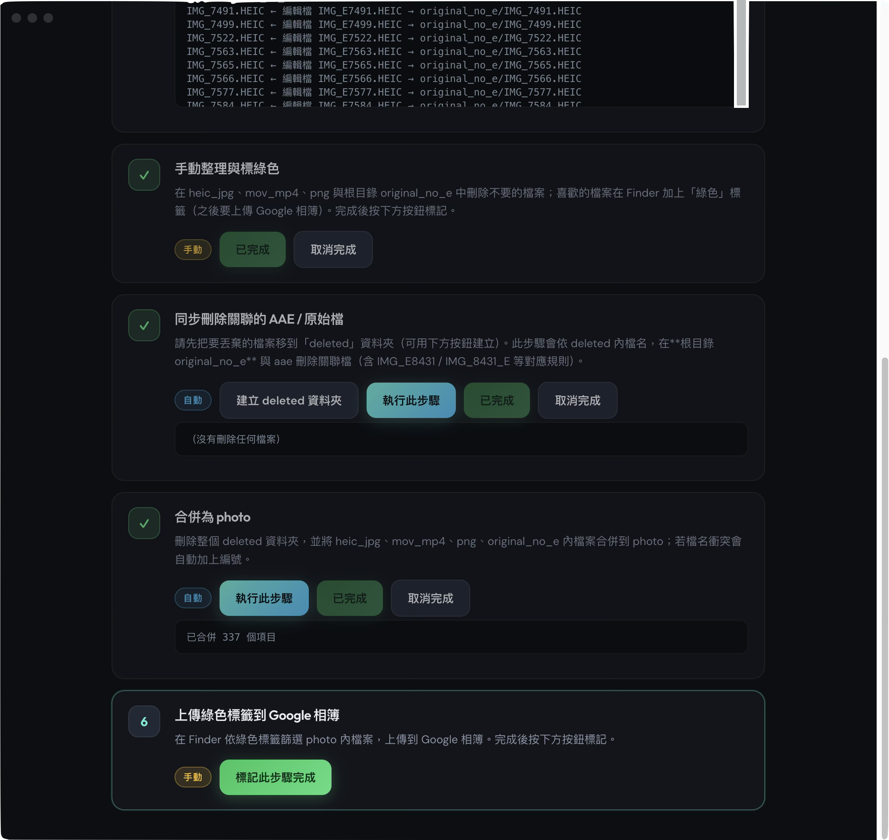

# 照片整理助手

每月整理 iPhone 備份照片用的 **macOS 桌面應用**（Electron + Vite + React）。依序完成「依副檔名分類 → 備份 `_E` / `IMG_E` 對應的原始檔 → 手動刪選 → 同步刪除關聯 AAE／原始檔 → 合併為 `photo` → 手動上傳相簿」等步驟，並在所選資料夾內保存 `.photo-organizer-state.json` 進度。

## 環境需求

- macOS（檔案操作與說明以 Finder 為準）
- [Node.js](https://nodejs.org/)（建議 LTS，僅開發／打包需要）

## 開發與打包

```bash
npm install
npm run dev
```

開發模式會啟動 Vite（預設 `http://localhost:5173`）並開啟 Electron 視窗。

```bash
npm run build
```

會先建置前端再透過 electron-builder 輸出安裝檔到 `release/`（例如 `.dmg`、`.zip`）。

## 功能概要

| 步驟 | 內容 |
|------|------|
| 1 | 將所選資料夾根目錄檔案依副檔名分到 `aae`、`heic_jpg`、`mov_mp4`、`png` |
| 2 | 在 `heic_jpg` 內偵測編輯檔名，將對應原始檔移到 `original_no_e`（可自行在 Finder 加標籤區分） |
| 3 | 手動刪除不要的檔案、標記要上傳的檔案後，在 App 內標記完成 |
| 4 | 依 `deleted` 內檔名比對數字鍵，同步刪除 `aae`、`original_no_e` 中的關聯檔 |
| 5 | 移除 `deleted`，將 `heic_jpg`、`mov_mp4`、`png` 等合併到 `photo` |
| 6 | 手動上傳到 Google 相簿等，完成後在 App 內標記 |

## 畫面預覽（screenshots）

以下圖檔皆放在專案 [`screenshots/`](screenshots/) 目錄，點圖可連到對應檔案路徑（在 GitHub／GitLab 上會開啟或下載原圖）。

### 主介面與步驟 1～3

選擇「月份／工作資料夾」後，可見六步驟流程中的前半：依副檔名分類、備份 `original_no_e`、以及手動整理說明。

[](screenshots/p1.png)

- 圖檔連結：[p1.png](screenshots/p1.png)

### 步驟 1～2 執行結果日誌

執行自動步驟後，介面下方會顯示檔案搬移與「編輯檔 ↔ 原始檔」對應關係等日誌，方便核對。

[](screenshots/p2.png)

- 圖檔連結：[p2.png](screenshots/p2.png)

### 步驟 3～6（手動整理、同步刪除、合併、上傳）

後半流程包含：手動刪選與標記、同步刪除關聯檔、合併為 `photo`、以及最後手動上傳相簿的說明。

[](screenshots/p3.png)

- 圖檔連結：[p3.png](screenshots/p3.png)

## 授權

本專案為個人／本機使用之工具，請依自己的需要下載使用。
